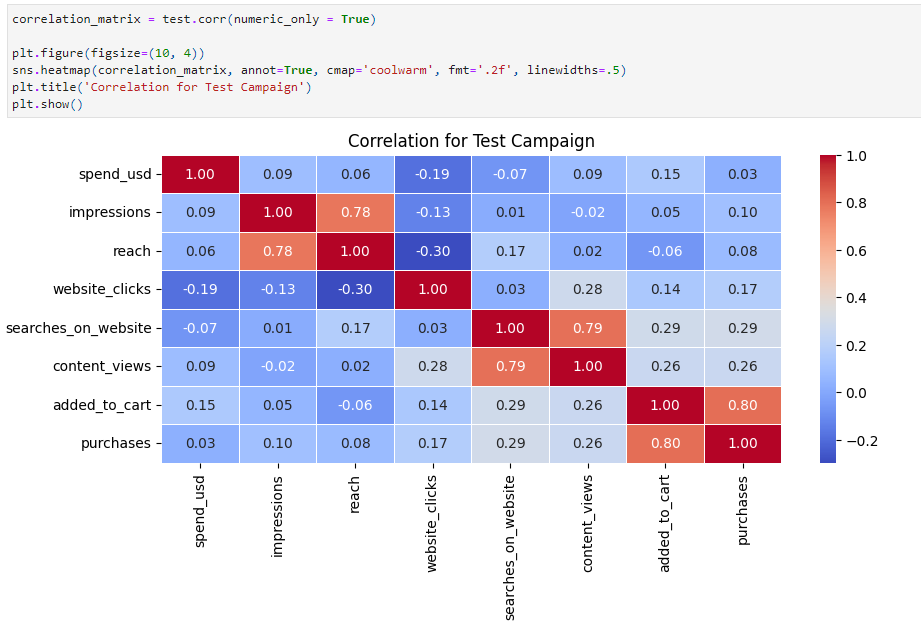
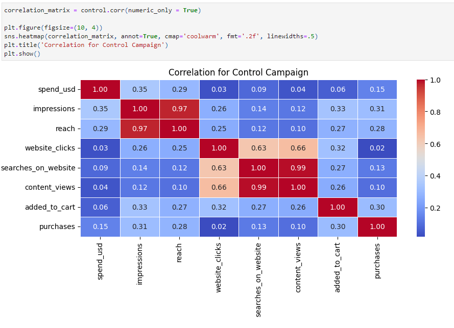
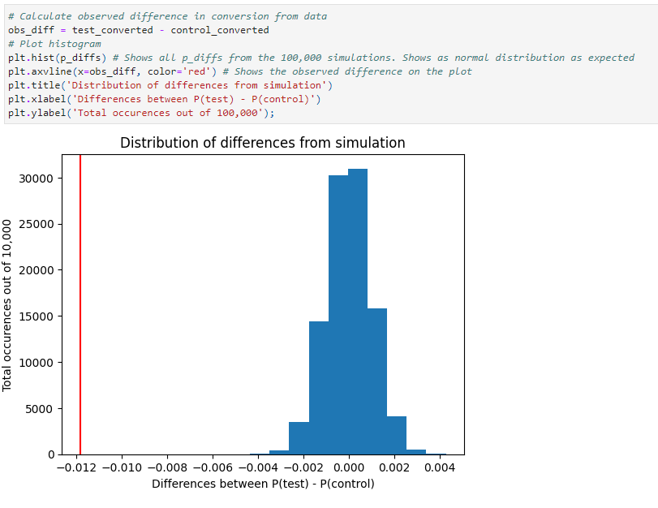

# Maximizing Conversion: A/B Testing Insights
This project analyzed the results of A/B testing for an ad campaign run by the fictional e-commerce company, Forest Prime.

## Project Overview
Forest Prime is preparing for a promotion that will run in August this year and wants to analyze the data for the last 5 years of A/B ad campaigns that were used in August to better understand which campaigns led to more purchases. The marketing team noticed that the campaigns used in August 2019 led to the most sales overall and are requesting an analysis of whether the test or control campaign led to more sales.

### Summary of Conclusions
The main goal of this project was to provide the marketing team for a company with an analysis of their test and control ad campaigns that was used in August 2019. After gathering the data, cleaning, and analyzing the data based on the hypotheses and Type 1 error rate, I have to fail to reject the null hypothesis due to the results of the z-test performed. This means there is not a statistical significance in the conversion rate for the test campaign and the control campaign. Additional correlations were shown using exploratory analysis.

## Project Scope
The project used a provided dataset from Kaggle to analyze the test and control ad campaigns from August 2019 to determine if the test campaign had a better conversion of website clicks to purchases than the control ad campaign. The project cleaned and combined the datasets, and the final dataset was saved as a csv for future use. The project included visualizations to help understand the analysis. All the analysis and visualizations are saved in a Jupyter notebook for future use.

This project did not include analyzing additional ad campaigns other than what was included in the downloaded dataset. This project did not include prediction models to determine if a customer is likely to purchase or not. This project did not include evaluating other relationships within the dataset such as but not limited to which campaign led to more impressions, or reach. This project did not include a reusable script to analyze future ad campaigns and did not include the creation of dashboards.

## Technology Used
- Anaconda
- Jupyter Notebook
- Python
- pandas
- NumPy
- Matplotlib
- Seaborn
- statsmodels

## Data Collection Process

### Data Gathering
The data was collected by downloading the `test_campaign.csv` and the `control_campaign.csv` files from [https://www.kaggle.com/datasets/amirmotefaker/ab-testing-dataset](https://www.kaggle.com/datasets/amirmotefaker/ab-testing-dataset).

### Data Quality and Completeness Observations
The datasets provided were high quality as the data was consistent and provided all the necessary fields to answer the business question.

There was a row with several missing values in the `control_campaign.csv`. The missing data was replaced with a value of 0 since the data came from an online dataset for an ad campaign and missing values typically means no results.

The date columns for both datasets were converted from strings to datetime format.

The `control_campaign.csv` had float values and these were converted to int64 datatypes.

The column names for both datasets were renamed to remove spaces and make reading the names easier.

Once all the cleaning was completed, the test and control datasets were merged into a single dataset and this master dataset was saved in the `data` folder as `campaigns.csv` for future use.

### Advantages of Data Set
- The dataset was relatively clean which made the cleaning and evaluations of the dataset quicker than expected.
- This dataset was easily accessible through Kaggle.
- All of the necessary features were available to answer the business question.

### Limitations of Data Set
- There were missing values for August 5, 2019 in the control dataset.
- This dataset was an aggregation of data and did not allow a targeted analysis of specific regions or users.

## Data Analysis Process

### Data Analysis Methods
Exploratory analysis was used to provide descriptive statistics about the data. This enabled the visualizations to show a correlation matrix for the different features for each of the campaigns. Specifically focused on the number of purchases for each campaign, a boxplot was shown for how each campaign did in overall purchases. Each campaign was used to show a histogram for number of purchases for each campaign. Scatterplots were used to also show possible correlations between website clicks and purchases as well as the possible correlations between the added_to_cart and purchases features for each campaign. Once this was done, the probability for converting website clicks to purchases regardless of ad campaign was calculated.

Then the probability of converting website clicks to purchases for the control campaign was calculated. Then the probability of converting website clicks to purchases for the test campaign was calculated. Then the probability that a website click was from the test campaign was calculated. From there the hypothesis testing was conducted using a normal (z) test. After this ztest was completed the differences in probabilities between the test and control campaign were simulated 100,000 times. This was shown as a histogram with the observed difference marked as a red vertical line.

## Data Analysis Results

### Statistical Significance
The Z-test was used to evaluate statistical significance. The null hypothesis was that the conversion rate for the test campaign is equal to or less than the conversion rate for the control campaign. The alternative hypothesis is that the conversion rate for the test campaign is greater than the conversion rate for the control campaign. Conversion rate for this analysis will be defined as the number of purchases divided by the number of website clicks.. A Z-test was used to compare the conversion of website clicks to purchases from both the test group and the control group. From this test I used both the z-score and the p-value. The alpha value was set at 0.05 or 5% and was used to determine statistical significance. This statistical test was appropriate because the test will be done on quantitative data across two different groups. The results of the z-test are below:

The p-value is the probability of getting a result equal or greater than the observed statistic. The closer to 0 the p-value is, the more statistically significant the results are. The closer to 1 the pvalue is, the less statistically significant the results are. Therefore, with the p-value from above being equal to 1.0 and the alpha value of 0.05 it means that there is no statistically significant difference between the test and control campaigns, and we should fail to reject the null hypothesis. The z-score represents how the observed value relates to the mean of the null and alternative hypotheses. It is measured in terms of standard deviations from the mean. Therefore, the z-score of -11.839 shows that the observed statistic is 11.839 standard deviations below the mean.

## Conclusion

### Correlation for Test campaign heatmap
Used to show correlations between all the different features for the test campaign. Specially for the research question this shows the correlation between website clicks and purchases.

### Correlation for Control Campaign heatmap
Used to show correlations between all the different features for the control campaign. Specifically for the research question this shows the correlation between website clicks and purchases.

### Histogram for distribution of differences from probability simulation
This shows a great representation of how the observed difference which also happened to be the z-score compares to the differences in probability in the simulations to show that there is not a significant difference in the different campaigns. This relates directly to the research question since it compares the conversion rate probabilities of the test and control campaigns.

### Recommended Courses of Action
Due to the average spend of each campaign and that we failed to reject the null hypothesis, it is recommended to choose the control campaign over the test campaign. Specifically, the control campaign showed to have a lower average spend than the test campaign and there was not a statistically significant difference between the two campaigns. While the test campaign did not show a statistically significant difference in the conversion rate, it did show a higher correlation between users adding items to the cart and completing purchases. Therefore, my second recommendation is a deeper analysis into the specific features or strategies implemented in the test campaign. By focusing on a deeper analysis the company can refine future campaigns in order to benefit from those insights and improve overall conversions.

## Extra
You can view the analysis in a Juypter Notebook by visting:

__Website:__ [forestprime.davidblackwelder.com](https://forestprime.davidblackwelder.com)